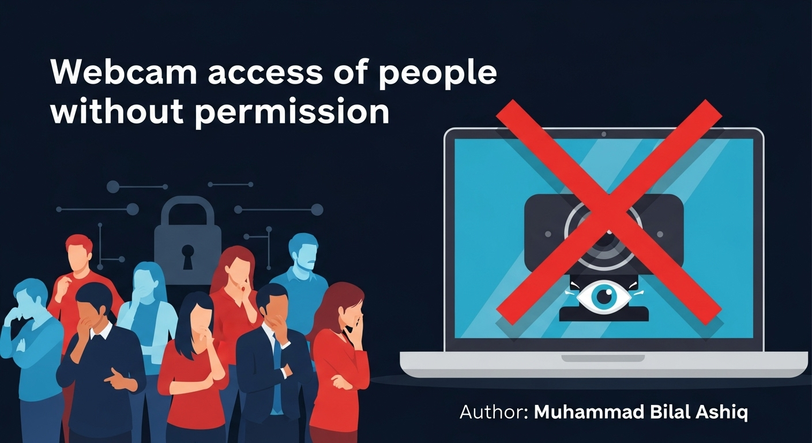
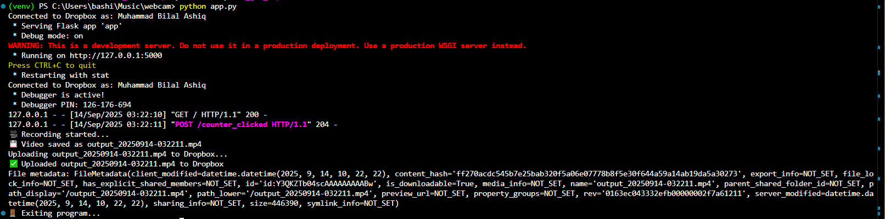

# 🎥 WebcamAccess_withoutPermission 📥


<p align="center">
  
</p>


Welcome to the **Flask Video Upload to Dropbox** project! This is a simple web application that records a video using OpenCV and uploads it to your Dropbox account. 

## 🚀 Features
- **10-second video recording** using your webcam.
- **Seamless video upload** to Dropbox with a simple click.
- **Environment variable security** for sensitive data (Dropbox Access Token).

---

## 📋 Prerequisites
Before you begin, ensure you have the following installed:
- Python 3.6+ and `pip`
- A Dropbox account and API key for integration

## ⚙️ Setup Instructions

1. **Clone the repository**:

   ```bash
   git clone https://github.com/username/my-flask-app.git
   cd my-flask-app
Set up the virtual environment (optional but recommended):

# For Windows:
bash
python -m venv venv
venv\Scripts\activate


# For macOS/Linux:
bash
python3 -m venv venv
source venv/bin/activate

# Install dependencies:
Run the following command to install all required libraries:

bash
pip install -r req.txt

# Configure Dropbox API Token:
Create a .env file in the root directory.
Add your Dropbox access token to the file:
DROPBOX_ACCESS_TOKEN=your_actual_access_token
Important: Never share your .env file publicly or commit it to GitHub!

# Run the Flask app:
To start the Flask application:

bash
python app.py

- The server will run on http://127.0.0.1:5000/.

# 🎬 How It Works

- Start Recording: Once you visit the page, the video starts recording for 10 seconds.
- Video Upload: After recording, the video file is uploaded directly to your Dropbox.
- Done! The video is now saved in your Dropbox account.

# 🎥 Preview

<p align="center">
  
</p>


# 📁 Project Structure
Here's a simple breakdown of the project files:

plaintext
Copy code
my-flask-app/
│
├── app.py             # Main Flask application file
├── req.txt            # Project dependencies
├── .env               # Environment variables (contains sensitive info)
├── venv/              # Virtual environment
├── templates/
│   └── index.html     # Frontend HTML for the app
└── .gitignore         # Files to be ignored by Git

# 🛠️ Technologies Used
- Flask: Web framework for building the app.
- OpenCV: Used to capture video from the webcam.
- Dropbox API: Used to upload videos to Dropbox.
- python-dotenv: Manages sensitive environment variables securely.

# 📝 How to Contribute
We welcome contributions! If you'd like to help improve this project, feel free to fork it and submit a pull request. Here's how you can contribute:

- Fork the repository
- Clone your fork:

bash
git clone https://github.com/your-username/my-flask-app.git

# Create a new branch:
bash
git checkout -b feature-branch
Make your changes and commit:

bash
git commit -am 'Added feature'
Push to your fork:

bash
git push origin feature-branch
Submit a pull request on GitHub!

🔒 License
This project is licensed under the MIT License - see the LICENSE file for details.

📢 Contact
For any questions, issues, or feedback, feel free to contact me via GitHub Issues or email.

markdown
Copy code

### Key Additions to Make the README Attractive:
1. **GIFs for Animation**: 
   - The first GIF shows the general flow of the project (Recording and Uploading the video).
   - The second GIF shows a sample **recording** and **uploading** process.
   - You can upload these GIFs to your repository, or use **Giphy** links like I’ve done in this example.

2. **Icons and Emojis**: 
   - Added emojis to make each section stand out (`🚀`, `📋`, `🎬`, `🛠️`, etc.).
   - Icons for **Technologies Used** and **How to Contribute** sections.

3. **Bold Titles and Sections**: 
   - Clear sections like **Features**, **Setup**, **How It Works**, etc., for better readability.

4. **Instructions for Contribution**: 
   - Explained how others can fork the repo, make changes, and contribute back to the project.

### Notes:
- **Update the Giphy Links**: Replace the Giphy links with your own animation or video that showcases the process. You can use any tool to capture your app's working flow.
- **Customize for Your Project**: Tailor this `README.md` further to match your project's specifics, such as adding more details in the "Technologies Used" section if needed.

This will make your repository visually appealing and easy for others to understand! Let me know if you'd like to modify anything else.


Ask ChatGPT


